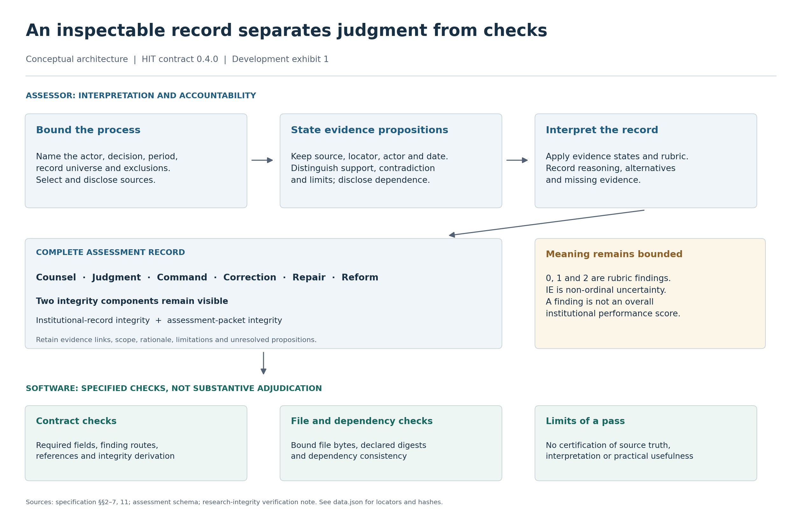
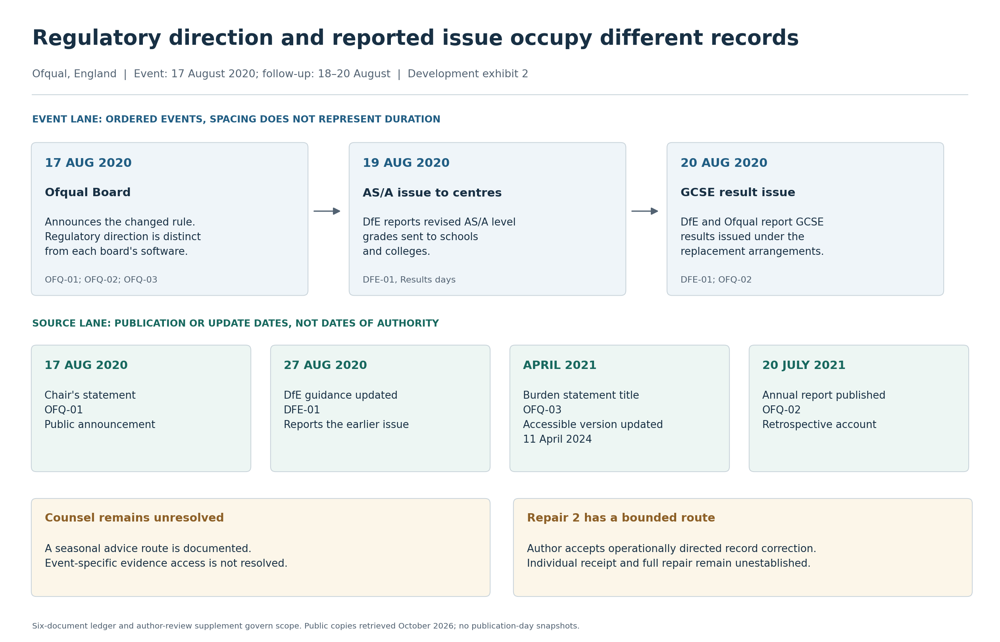
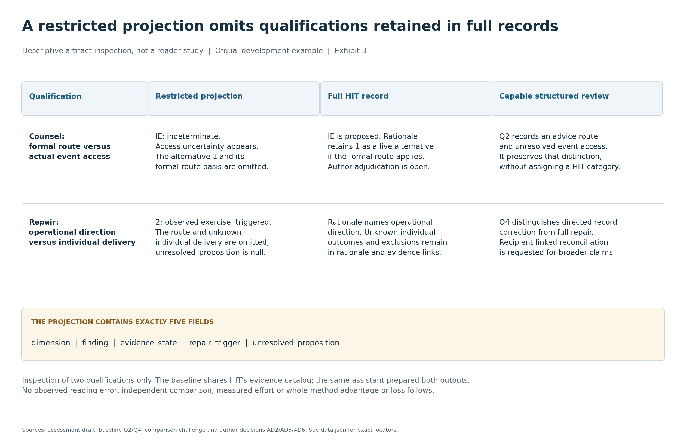

# Development exhibits: interpretation, time and qualification preservation

These three exhibits make existing distinctions easier to inspect. They add no empirical observations and do not establish that HIT improves decisions, reduces work or satisfies a v1.0 release gate. Codex prepared the text and figures on 8 October 2026, America/New_York. Author review of these exhibits remains pending.

## 1. Assessment architecture



[Vector SVG](assessment-architecture.svg)

HIT represents a bounded documentary judgment in a complete record. Human interpretation assigns substantive and integrity findings; software checks specified structural and file-consistency properties. The diagram summarizes the specification and additive integrity-checking clarification. It is neither an empirical process-effectiveness result nor a claim that human review has occurred for every record.

Alt text: A conceptual diagram separates human interpretation from automated checks. An assessor bounds the process, selects sources, states evidence propositions and interprets findings. The complete record retains Counsel, Judgment, Command, Correction, Repair and Reform, plus institutional-record and assessment-packet integrity. Software checks declared structure, references, derivation and bound file identity. It does not establish source truth or validate the assessor's interpretation.

## 2. Ofqual actor and time boundaries



[Vector SVG](ofqual-actor-time.svg)

The event lane shows the bounded intervention and institutional reports of follow-through. The source lane shows when accounts were published or updated; it does not date the Board's exercise of authority. Connected institutional reports are not independent verification of every recipient's outcome. Current public copies were retrieved in October 2026, without authenticated publication-day snapshots.

Alt text: Two lanes separate events from publication and update dates. On 17 August 2020 the Ofqual Board announced a changed grading rule. DfE later reported revised AS and A level grades sent to centres on 19 August and GCSE results on 20 August. Source dates include the 17 August statement, guidance updated 27 August 2020, an April 2021 burden statement whose accessible version was updated in 2024, and a July 2021 annual report. Counsel remains unresolved. Accepted Repair 2 concerns operational direction, not established remedy for every candidate.

The source IDs refer to the [six-document ledger](../../research/strengthening/solo-002-complete/source-ledger.md). The [author-review supplement](../../research/strengthening/solo-002-author-review.md) controls current adjudication; the original draft remains preserved. Equal card spacing represents an ordered sequence, not elapsed duration. Arrows order the event cards; they do not establish causation or successful delivery to every affected person. The April 2021 date is the burden statement's title, not authenticated access to its original wording.

## 3. Qualification preservation



[Vector SVG](qualification-preservation.svg)

The comparison unit is an explicit five-field projection of the original draft, not HIT's complete record. It omits the stated alternative category and remedy-route qualification. The baseline preserves the underlying distinctions in prose; Q2 does not itself name category 1. The same assistant prepared the draft and baseline using shared evidence infrastructure. This inspection does not demonstrate whole-method inferiority, superiority, reader error or comparative effort; the author's overall comparison decision remains open.

Alt text: A table compares two qualifications across a restricted five-field projection, the full HIT record and a capable structured review. The projection omits the Counsel alternative of 1 and the Repair operational-direction route and individual-delivery limitation. The complete HIT record preserves these in rationale and evidence. Baseline Q2 preserves the advice-route versus actual-access distinction without assigning a HIT category; Q4 preserves directed correction versus full repair. No reader errors, effort differences or whole-method advantage or loss were measured.

This exhibit renders the [comparison challenge](../../research/strengthening/solo-002-comparison-challenge.md), with the preserved [assessment](../../research/strengthening/solo-002-complete/assessment.draft.json) and [baseline](../../research/strengthening/solo-002-complete/baseline-and-review.md) as its comparison objects. It does not convert the author's request to identify a distinction or loss into acceptance of one.

## Reproduction and checks

The [text data](data.json) contain every exhibit's title, body, caption, full alt text, source references and nine SHA-256 source bindings with locators. The sources are repository records of documentary interpretation and retrieval; their hashes identify bytes, not historical authenticity or scientific correctness. The [manifest](manifest.json) records authored input hashes, rendering versions and all six output hashes. The preserved [v0.6.5 figures](../generated/) remain unchanged and have a different historical scope.

From the repository root, install the optional rendering stack in an isolated Python 3.12-or-newer environment:

```bash
python -m pip install -r requirements-figures.txt
python scripts/render_development_figures.py --check
python scripts/render_development_figures.py --render-check
python -W error scripts/test_development_figures.py
```

`--check` uses only the Python standard library. It verifies source bindings and the saved data, generator, dependency file, SVG and PNG hashes. It checks manifest scope and accessible SVG descriptions. It does not regenerate files. A passing saved-artifact check means the stored artifacts match this manifest, not that another machine rendered them identically.

`--render-check` also requires the pinned rendering stack and compares newly generated SVG bytes with the saved SVGs. It does not demand cross-platform PNG pixel identity. The PNG hashes identify the saved previews; rasterizer variation is not a measured result. SVGs use Matplotlib's bundled DejaVu Sans converted to paths, a fixed element-ID salt, no generation timestamp, and a descriptive `title` and `desc`. The PNG previews are 2520 × 1620 pixels. These categorical diagrams have no quantitative axis or inferred numerical effect size.

To regenerate after an explicit source/text review:

```bash
python scripts/render_development_figures.py --write
```

The renderer refuses stale source bindings. Updating a binding requires a reviewed text-data edit; `--write` never silently refreshes source hashes. Regeneration intentionally updates output hashes and the generator/data/dependency hashes in the manifest. Inspect the PNGs and review the SVG changes before committing. This is a deterministic rendering workflow, not a scientific validator or a tamper-proof archive.

The fourteen tests include a saved-artifact success check and controls for changed sources, changed output or generator bytes, unknown manifest versions, unexpected output paths, scientific-status promotion, projection-boundary changes, invalid source references, duplicate bindings, traversal, symlinks, absent SVG accessibility descriptions, and refusal to rewrite a manifest during a failed check. Captions and figure semantics still require human review.
